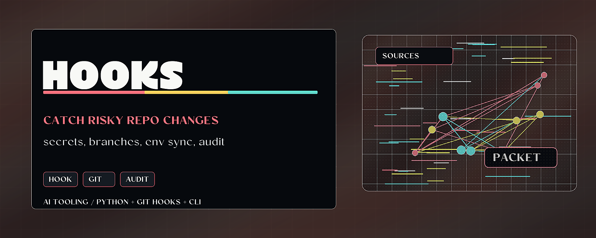

# Agent Hook Pack



> Install public-safe hooks that catch risky repo changes before commit.

Agent Hook Pack packages small git and agent hooks for secret checks, branch
guards, environment-template sync, and hook inventory audits. It is intentionally
generic so public repos can use it without importing private policy layers.

## Why it matters

AI-assisted work can produce lots of small file edits quickly. Hooks give the
repo a cheap local checkpoint before sensitive files, wrong branches, or stale
environment templates become a release problem.

## Try it

```bash
python -m pip install -e .
agent-hook-pack audit
agent-hook-pack list
```

## What to test first

- `agent-hook-pack audit` verifies the packaged hook inventory.
- `agent-hook-pack install --target .claude/hooks` installs hooks into a target directory.
- `python -m pytest` runs the local regression suite.

## Current status

Public-safe Python package and CLI. The hooks are generic and reviewed for
release hygiene; private policy layers are intentionally omitted.

## Existing technical notes

> Public-safe local git/agent hooks: secret checks, branch guards, and pre-commit hygiene.

[](LICENSE)


[](https://github.com/HarperZ9/agent-hook-pack/actions/workflows/ci.yml)

[](https://harperz9.github.io)

Included hooks:

- `block-secrets.py`
- `check-branch.sh`
- `check-env-sync.sh`
- `verify-no-secrets.sh`
- `lint-on-save.sh`

Use it when you want lightweight secret checks, branch guardrails, env-template
sync checks, and consistent hook deployment.

`agent-hook-pack audit` checks the packaged hook inventory, empty files,
shebang/runtime shape, and obvious credential-shaped strings.

Built with agentic tooling and manually reviewed before publish.

## Install

```bash
python -m pip install -e .
```

## Usage

```bash
agent-hook-pack audit
agent-hook-pack list
agent-hook-pack install --target .claude/hooks
agent-hook-pack path
```

See [USAGE.md](USAGE.md) for a step-by-step guide, the importable Python API,
and worked examples with expected output. A runnable demo lives in
[examples/demo.py](examples/demo.py).

## Note

The hooks are generic, intentionally scoped, and omit private policy layers.
Synthetic tests should assemble credential-shaped examples at runtime instead
of committing complete fake tokens.

---
**Zain Dana Harper** -- small tools with explicit edges.
[Portfolio](https://harperz9.github.io) · [HarperZ9](https://github.com/HarperZ9)
<sub>Built with Claude Code; reviewed, tested, and owned by me.</sub>

## For developers

Keep the public README, package metadata, and examples aligned with current behavior. Before opening a PR or pushing a release, run the local package verification path.

```bash
python -m pip install -e ".[test]"
python -m pytest
```
