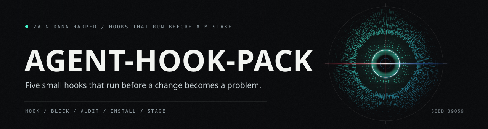

<p align="center"></p>

# Agent Hook Pack

> Install public-safe hooks that catch risky repo changes before commit.

Agent Hook Pack packages small git and agent hooks for secret checks, branch
guards, environment-template sync, and hook inventory audits. It is intentionally
generic so public repos can use it without importing private policy layers.

## Why it matters

AI-assisted work can produce lots of small file edits quickly. Hooks give the
repo a cheap local checkpoint before sensitive files, wrong branches, or stale
environment templates become a release problem.

## How a hook answers

A hook is handed the proposed call on standard input and answers with an exit
code. It never rewrites the proposal, and the tool that called it is the thing
that stops.

![Eight stages from a proposed edit to an exit code: proposal, payload, scaffold, basename, components, exit code, reason, error. An agent asks to read or edit a file. The hook is handed the tool name and the file path as JSON on standard input, and a call with no file path is let through untouched. A write to a file whose name starts with .env is allowed, because scaffolding a template is not the same as reading an existing one. The file's base name is matched against sixteen names that are never opened. The path is then split into parts and checked against four credential directories, matched as whole components so a module named private_key is not caught by accident. Exit zero lets the call proceed and exit two stops it. A block prints the path and the reason on standard error, which is what the calling tool shows. A hook that raises exits one, so a broken check is visible instead of silently permissive. Three outcomes: allowed, blocked, and hook error.](docs/art/proposal-lane.svg)

`verify-no-secrets.sh` runs at the other end of the turn. By then there is an
index to read, so it works on what was actually staged rather than on what was
proposed, and it blocks while the secret is still only staged.

![Eight stages of the stop-time sweep: turn ends, repository, staged list, base names, key files, contents, report, block. The hook runs when the assistant finishes a turn, ahead of any commit. Outside a git working tree it exits immediately, and so does an empty index. The staged list comes from git diff cached, so only files already added are considered. Eight base names are refused outright, among them .env and credentials.json. Private key files are caught by name too, including any pem or key suffix. For each staged file still present on disk, the contents are read and matched against six credential shapes: a generic key or password assignment, an AWS access key, a GitHub token, a Slack token, a live Stripe key, and a PEM private key header. Every hit is named on standard error, path by path. Exit two stops the turn, so the secret is found while it is still only staged. Three outcomes: clean, blocked, and not a repository.](docs/art/staged-sweep-lane.svg)

## Try it

```bash
python -m pip install -e .
agent-hook-pack audit
agent-hook-pack list
```

## What to test first

- `agent-hook-pack audit` verifies the packaged hook inventory.
- `agent-hook-pack install --target .claude/hooks` installs hooks into a target directory.
- `python -m pytest` runs the local regression suite.

## Current status

Public-safe Python package and CLI. The hooks are generic and reviewed for
release hygiene; private policy layers are intentionally omitted.

## Existing technical notes

> Public-safe local git/agent hooks: secret checks, branch guards, and pre-commit hygiene.

[](LICENSE)


[](https://github.com/HarperZ9/agent-hook-pack/actions/workflows/ci.yml)

[](https://harperz9.github.io)

Included hooks:

- `block-secrets.py`
- `check-branch.sh`
- `check-env-sync.sh`
- `verify-no-secrets.sh`
- `lint-on-save.sh`

Use it when you want lightweight secret checks, branch guardrails, env-template
sync checks, and consistent hook deployment.

`agent-hook-pack audit` checks the packaged hook inventory, empty files,
shebang/runtime shape, and obvious credential-shaped strings.

![The nine findings an audit can return, one to a row, each with what raises it and what the audit read to raise it. A missing source directory is reported alone, because nothing else can be inspected. A missing required hook is one of five fixed names. An empty file, a first line that is not a shebang, and a shebang naming the wrong interpreter are each their own finding. The last four are credential shapes found in the hook text itself: a GitHub token, an API key prefix, an AWS access key identifier, and a PEM private key header. The empty-file row is accented, because inspection of that file stops there and no further check runs against it.](docs/art/audit-findings.svg)

Built with agentic tooling and manually reviewed before publish.

## Install

```bash
python -m pip install -e .
```

## Usage

```bash
agent-hook-pack audit
agent-hook-pack list
agent-hook-pack install --target .claude/hooks
agent-hook-pack path
```

See [USAGE.md](USAGE.md) for a step-by-step guide, the importable Python API,
and worked examples with expected output. A runnable demo lives in
[examples/demo.py](examples/demo.py).

## Note

The hooks are generic, intentionally scoped, and omit private policy layers.
Synthetic tests should assemble credential-shaped examples at runtime instead
of committing complete fake tokens.

---
**Zain Dana Harper** -- small tools with explicit edges.
[Portfolio](https://harperz9.github.io) · [HarperZ9](https://github.com/HarperZ9)
<sub>Built with Claude Code; reviewed, tested, and owned by me.</sub>

## For developers

Keep the public README, package metadata, and examples aligned with current behavior. Before opening a PR or pushing a release, run the local package verification path.

```bash
python -m pip install -e ".[test]"
python -m pytest
```

---

**[Zentropy Labs](https://github.com/ZentropyLabs-ai)** · order out of entropy. An independent lab building evidence-first tools that leave a re-checkable artifact behind. Built by Zain Dana Harper in Seattle. The full workbench is at [Project Telos](https://harperz9.github.io).
